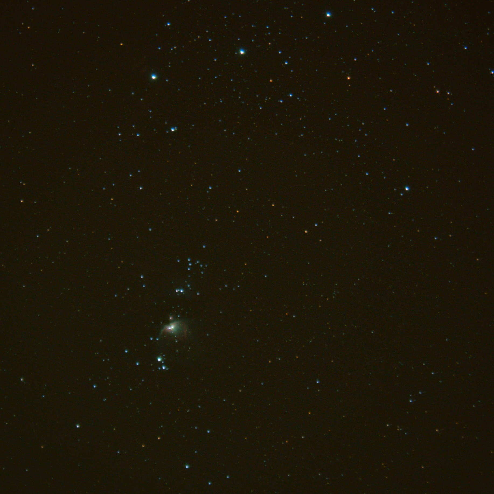
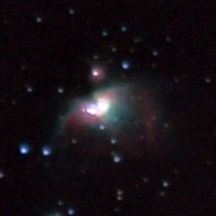
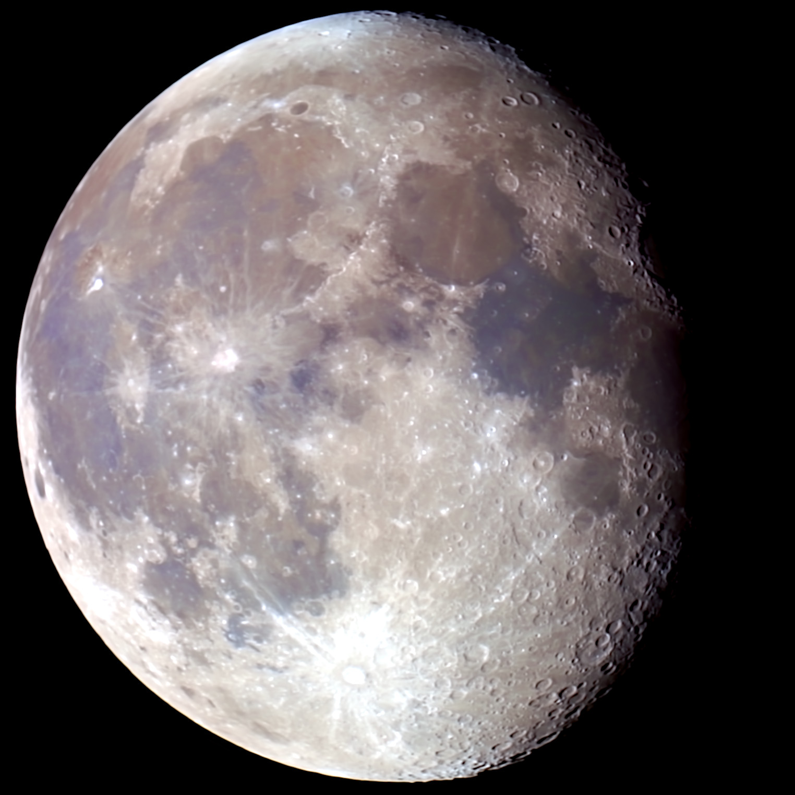
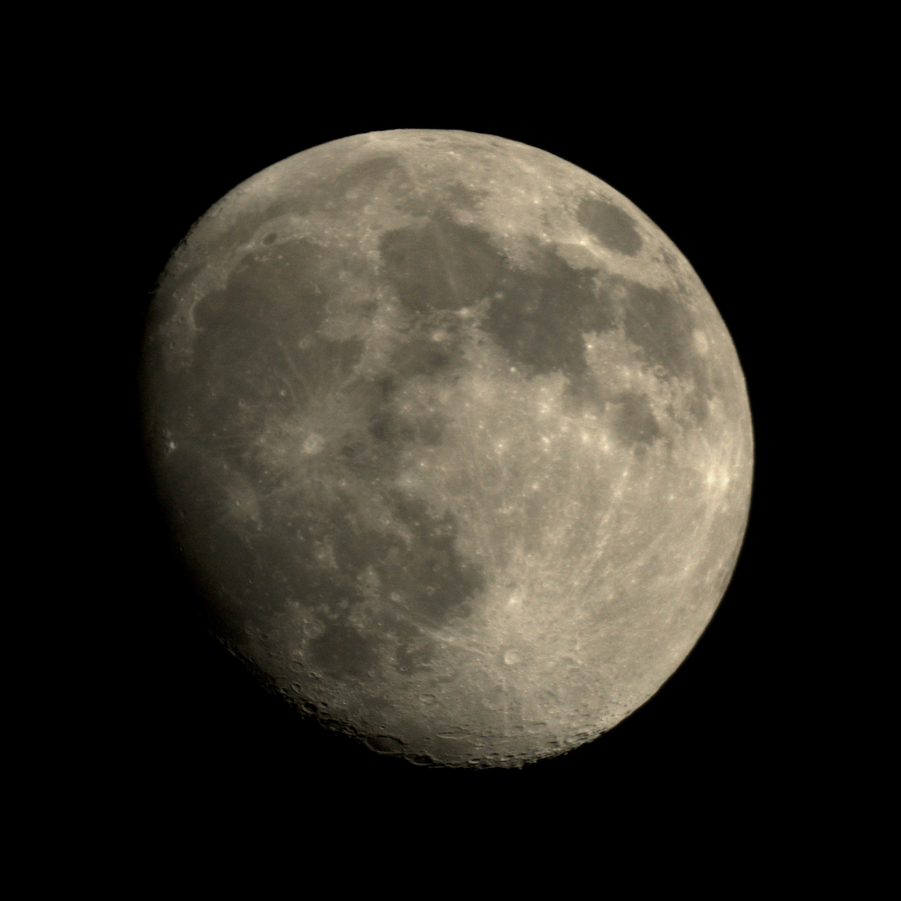

# Astrophotos
- [Planetary](#planetary)
 - [Jupiter](#jupiter)
 - [Saturn](#saturn)
- [Deepsky](#deepsky)
 - [Orionnebula](#orionnebula)
 - [Andromeda](#andromeda)
 - [Constellations](#constellations)
- [Moon](#moon)
 - [Full Disc](#full-disc)
 - [Close Up](#close-up)

## Planetary
### Jupiter

Jupiter - Wasserkuppe 26.09.23

    

        

        Jupiter - Wasserkuppe 26.09.23
    

    

        

        Jupiter with 2 moons - Gießen 21.09.23
    

  

### Saturn

Saturn - Gießen 21.09.23

## Deepsky
### Orionnebula

    

        

        Orionnebula - Gießen 04.02.23
    

    

        

        Orionnebula cropped - Gießen 04.02.23
    

      

### Andromeda

Andromeda - Gießen 21.09.23

## Constellations

Plejads on the left and Jupiter on the right - Gießen 21.09.23

## Moon

### Full Disc

Mond - Gießen 02.09.23

    

        

        Mond - Gießen 02.09.23
    

    

        

        Mond - Gießen 06.05.23
    

      

### Close Up

Tycho - Gießen 26.11.23

    

        

        (through Clouds) Gießen 26.11.23
    

    

        

        (through Clouds) Gießen 26.11.23
    

      

    

        

        Tycho (through Clouds) - Gießen 26.11.23
    

    

    

      

